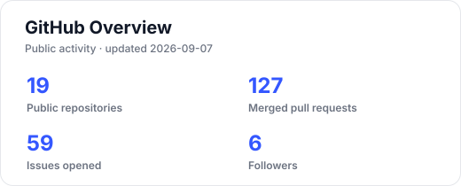
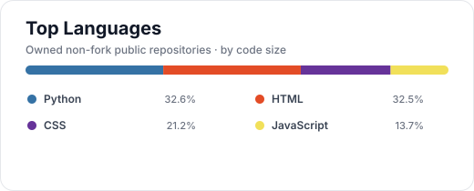

### 아이디어를 API와 데이터 구조로 구체화하고, 배포와 운영까지 연결합니다.

FastAPI · NestJS · PostgreSQL을 중심으로 서비스를 만들고 운영하는 백엔드 개발자 **김찬혁**입니다. 
AI 모델과 외부 API를 제품 흐름에 연결하고, 팀의 API 계약과 배포 과정까지 책임지는 일을 좋아합니다.

## About Me

- 인하대학교에 재학 중이며, **Backend · AI Integration · Service Operations**에 집중하고 있습니다.
- 기능 구현에 그치지 않고 API 명세, ERD, 테스트, 배포, 운영 문서까지 서비스 생명주기를 함께 다룹니다.
- HomeFit에서는 **Backend Team Lead**로 도메인별 API 계약과 PR 우선순위, Android 연동, 테스트 시나리오를 조율했습니다.
- 메모라이즈를 1인 개발·운영하며 **회원 449명, 14일 학습 완료 16,496회, 최고 동시 접속 36명**의 사용 기록을 만들었습니다.
- 막히는 문제를 숨기지 않고 문서와 실험으로 공유하며, 팀이 빠르게 결정하고 끝까지 완주하도록 돕습니다.

## Highlights

| 구분 | 성과 |
| --- | --- |
| 🏠 Backend Leadership | HomeFit 백엔드 팀장 · NestJS/Prisma API · Android 통합 테스트 · 부산 BEXCO 데모데이 운영 |
| ☁️ Cloud & Delivery | Railway에서 AWS ALB·EC2 Auto Scaling·RDS·ECR·S3로 확장하고 Terraform·GitHub Actions OIDC로 IaC/CI/CD 구성 |
| 📚 Production Operation | 메모라이즈 기획부터 React·FastAPI·PostgreSQL·OpenAI 연동, 배포와 운영까지 1인 수행 |
| 🤖 AI Integration | MediaPipe·TensorFlow 실시간 추론, PyTorch·ResNet18·Grad-CAM 이상탐지, Hugging Face·OpenAI API 기반 서비스 연계 |
| 🏅 Recognition | UMC 10th Backend(Node.js) 베스트 챌린저 · 프로젝트 대상 2회 · 최우수상 1회 · 우수상 1회 |

## Tech Stack

### Languages · Backend · Database

  

  
  
  
  
  

### Cloud · Infra · Tools

  

  
  
  

### AI · Data · Frontend

  

  
  
  
  

## Featured Projects

| 프로젝트 | 역할 | 핵심 구현과 결과 |
| --- | --- | --- |
| [📚 메모라이즈](https://samuel-school.vercel.app/) | 1인 Full-stack · 운영 | React·FastAPI·PostgreSQL 기반 암기 학습 서비스. OpenAI 퀴즈 생성과 운영 대시보드 구축 · [Repository](https://github.com/inhadissolve/samuel-school) |
| [🏠 HomeFit](https://github.com/inhadissolve/homefit-showcase) | Backend Team Lead | NestJS·Prisma 기반 청년 주거·금융 API, 멱등 Seed와 E2E, Android 연동, AWS Terraform·CI/CD 구축. CPU 크레딧 소진 장애 원인 추적 후 자동 복구 구조 구축 · UMC 베스트 챌린저 선정 |
| [🤟 수담(手談)](https://github.com/KSEB-MEGA-CREW) | Team Lead · AI Pipeline | MediaPipe·TensorFlow·FastAPI 기반 실시간 수어 인식/번역. 예측 안정화와 추론 API 구현 · 최우수상·우수상 |
| [🏭 RealGain](https://github.com/RealGain-5) | ML · Integration | 진동 데이터를 Orbit 이미지로 변환하고 ResNet18·Grad-CAM으로 이상 탐지 및 판단 근거 시각화 · 대상 |
| [📰 IssueOne](https://issue-one.vercel.app/) | AI · Backend | RSS 수집·정제·요약 API와 배포 메모리 제약 대응. Hugging Face/OpenAI API 전환 · [Repository](https://github.com/KSEB-4-E) · 대상 |
| [🌱 GreenBrain](https://github.com/GreenBrain-Inha/BE_GreenBrain) | Backend | 챌린지 인증, 피드, 토큰 보상 API와 Supabase Storage 연동 |

> 실제 화면, 아키텍처, 문제 해결 과정과 수상 증빙은 **[포트폴리오의 프로젝트 사례 연구](https://inhadissolve.github.io/portfolio/#projects)**에서 확인할 수 있습니다.

## Experience & Awards

| 기간 | 내용 |
| --- | --- |
| 2026.03 ~ 2026.08 | 🏅 **UMC 10th Backend(Node.js) 베스트 챌린저** · HomeFit Backend Team Lead |
| 2025.09 ~ 2025.12 | 🏆 탄소중립 Innovation Academy 5기 기업연계 프로젝트 **대상(1위)** |
| 2025.09 ~ 2025.10 | 🥇 인하대학교 오픈소스 SW 페스티벌 **최우수상·총장상(1위)** |
| 2025.07 ~ 2025.09 | 🥉 KSEB 팀 프로젝트 수담 **우수상(3위)** |
| 2025.03 ~ 2025.06 | 🥇 KSEB 미니프로젝트 IssueOne **대상(1위)** |
| 2025.01 ~ 2025.11 | 🎓 KSEB 부트캠프 4기 수료 · **개인 우수 교육생**(전체 수료생 중 8명 선정) |

## GitHub Stats

  
  

GitHub API 기준 · fork 저장소를 제외한 공개 저장소 언어 통계 · 매주 자동 갱신

## Contact

- Portfolio: [inhadissolve.github.io/portfolio](https://inhadissolve.github.io/portfolio/)
- GitHub: [github.com/inhadissolve](https://github.com/inhadissolve)
- Blog: [blog.naver.com/dissolve_chan](https://blog.naver.com/dissolve_chan)
- Email: [dissolve1882@naver.com](mailto:dissolve1882@naver.com)
